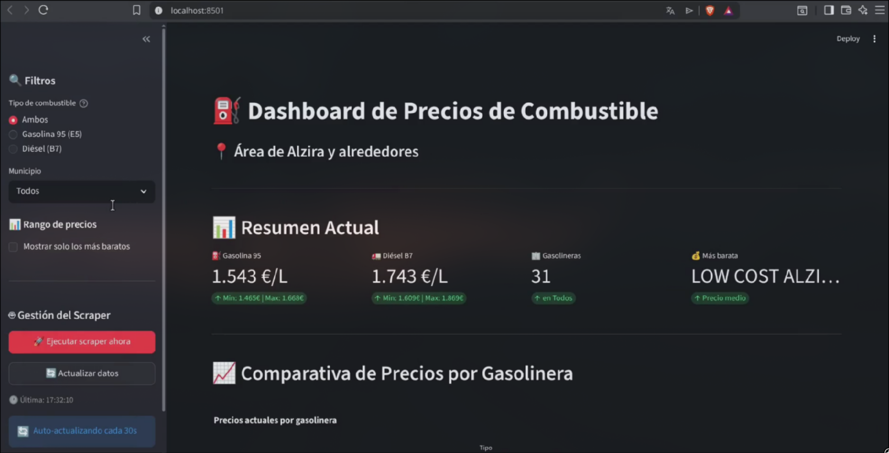
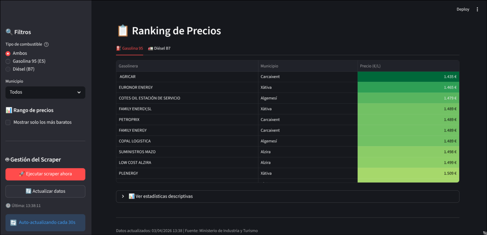

# ⛽ Monitor de Precios de Combustible

Sistema de monitorización de precios de combustible (Gasolina 95 y Diésel B7) para la Comunidad Valenciana.

## 📋 Descripción del Proyecto

Proyecto educativo para la asignatura de **Sistemas de Big Data** (UD3 - Web Scraping) que implementa un ecosistema completo:

- **Web Scraping** automático de la API oficial del [Geoportal de Minería](https://geoportal.minco.gob.es)
- **Almacenamiento** en MongoDB para mantener histórico de precios
- **Dashboard interactivo** con Streamlit para visualización de datos
- **Automatización** mediante threading y Task Scheduler (Windows) / cron (Linux)

## 🏗️ Arquitectura

```
┌─────────────────┐     ┌──────────────┐     ┌─────────────┐     ┌─────────────┐
│  API Geoportal  │────▶│   Scraper    │────▶│  MongoDB    │────▶│  Dashboard  │
│  (Ministerio)   │     │  (Python)    │     │  (Docker)   │     │ (Streamlit) │
└─────────────────┘     └──────────────┘     └─────────────┘     └─────────────┘
                               │
                               ▼
                        ┌──────────────┐
                        │   Timer      │
                        │ (Threading)  │
                        └──────────────┘
```

## 📦 Requisitos Previos

### 1. Python 3.12+

Verifica que tienes Python instalado:

```bash
python --version  # Debe ser 3.12 o superior
```

### 2. Docker y Docker Compose

El proyecto utiliza Docker Compose para desplegar MongoDB y Mongo Express (interfaz web de administración).

**Instalar Docker:**
- [Windows/Mac](https://www.docker.com/products/docker-desktop/)
- [Linux](https://docs.docker.com/engine/install/)

Verifica la instalación:

```bash
docker --version
docker compose --version
```

### 3. Google Chrome / Chromium

Necesario para el scraping con Selenium:

```bash
# Verificar Chrome
google-chrome --version

# O verificar Chromium
chromium --version
```

---

## 🚀 Guía de Instalación Paso a Paso

### Paso 1: Clonar el repositorio

```bash
git clone https://github.com/jbotgil/DashboardCombustibleAlzira.git
cd DashboardCombustibleAlzira
```

### Paso 2: Levantar los servicios con Docker Compose

El archivo `compose.yaml` incluye:
- **MongoDB**: Base de datos NoSQL
- **Mongo Express**: Interfaz web para gestionar MongoDB (disponible en `http://localhost:8081`)

```bash
# Iniciar los contenedores en segundo plano
docker compose up -d
```

Verifica que los servicios están corriendo:

```bash
docker compose ps
```

**Salida esperada:**
```
NAME            STATUS    PORTS
mongo_db        Up        0.0.0.0:27017->27017
mongo_express   Up        0.0.0.0:8081->8081
```

**Acceder a Mongo Express:**
- URL: `http://localhost:8081`
- Usuario: `adminweb`
- Contraseña: `webPass123`

### Paso 3: Crear y activar el entorno virtual de Python

```bash
python -m venv .venv

# Linux/Mac
source .venv/bin/activate

# Windows
.venv\Scripts\activate
```

### Paso 4: Instalar dependencias

```bash
pip install -r requirements.txt
```

### Paso 5: Configurar el archivo `.env`

#### ¿Qué es el archivo `.env`?

El archivo `.env` contiene las **variables de entorno** que la aplicación utiliza para conectarse a MongoDB. Es importante porque:

1. **Separa configuración del código**: No necesitas hardcodear credenciales en el código Python
2. **Seguridad**: Este archivo está en `.gitignore`, así que tus credenciales nunca se subirán a GitHub
3. **Flexibilidad**: Puedes tener diferentes configuraciones para desarrollo, producción, etc.

#### ¿Qué contiene `.env.example`?

El archivo `.env.example` es una **plantilla** que muestra qué variables necesitas configurar:

```env
# Configuración de MongoDB
MONGO_HOST=localhost
MONGO_PORT=27017
MONGO_USER=admin
MONGO_PASS=miPassword123
```

| Variable | Descripción | Valor por defecto |
|----------|-------------|-------------------|
| `MONGO_HOST` | Host donde corre MongoDB | `localhost` |
| `MONGO_PORT` | Puerto de MongoDB | `27017` |
| `MONGO_USER` | Usuario de MongoDB (debe coincidir con `MONGO_INITDB_ROOT_USERNAME` en Docker) | `admin` |
| `MONGO_PASS` | Contraseña de MongoDB (debe coincidir con `MONGO_INITDB_ROOT_PASSWORD` en Docker) | `miPassword123` |

#### Pasos para configurar:

```bash
# Copiar la plantilla
cp .env.example .env
```

El archivo `.env` ya está preconfigurado con los valores correctos para que funcionen con Docker Compose. Si cambias las credenciales en `compose.yaml`, debes actualizar también `.env`.

---

## 📁 Estructura del Proyecto

```
WebScrapingUD3/
├── .venv/                  # Entorno virtual de Python
├── .env                    # Variables de entorno (NO subir a Git)
├── .env.example            # Plantilla de ejemplo para .env
├── .gitignore              # Archivos a ignorar en Git
├── compose.yaml            # Configuración de Docker Compose
├── database_config.py      # Configuración de conexión a MongoDB
├── scraper.py              # Script de web scraping
├── dashboard.py            # Dashboard interactivo de Streamlit
├── setup_cron.py           # Script para configurar cron automáticamente
├── requirements.txt        # Dependencias de Python
└── README.md               # Esta documentación
```

---

## 🔧 Uso

### Ejecutar el Scraper

```bash
source .venv/bin/activate

# Ejecución única (para probar)
python scraper.py --una-vez

# Ejecutar continuamente cada 1 hora (default)
python scraper.py

# Ejecutar cada 30 minutos
python scraper.py --intervalo 0.5

# Ejecutar cada 6 horas
python scraper.py --intervalo 6
```

### Ejecutar el Dashboard

```bash
source .venv/bin/activate
streamlit run dashboard.py
```

El dashboard se abrirá automáticamente en: `http://localhost:8501`

---

## 📊 Características del Dashboard

El dashboard proporciona una interfaz visual interactiva con actualización automática cada 30 segundos:


*Vista general con métricas, comparativas y mapa de calor*


*Análisis de relación de precios y ranking de gasolineras*

1. **Métricas principales**
   - Precio medio de Gasolina 95 y Diésel B7
   - Gasolinera más barata
   - Número de gasolineras monitorizadas

2. **Gráfico de barras comparativo**
   - Comparación de precios entre gasolineras

3. **Gráfico de dispersión**
   - Relación entre precios de gasolina y diésel

4. **Mapa de calor**
   - Visualización tipo matriz con códigos de color

5. **Ranking de precios**
   - Tablas ordenadas con gradiente de color

6. **Filtros interactivos**
   - Por municipio
   - Por tipo de combustible
   - Mostrar solo los más baratos

---

## 🪟 Automatización

### Windows Task Scheduler

```cmd
schtasks /Create /TN "ScraperCombustible" /TR "python.exe C:\ruta\scraper.py --una-vez" /SC HOURLY /MO 1 /RU "SYSTEM" /F
```

### Linux / macOS (cron)

#### 🎯 Opción recomendada: Script `setup_cron.py`

El proyecto incluye un script interactivo que facilita la configuración de cron **sin necesidad de editar manualmente el crontab**.

**¿Qué hace `setup_cron.py`?**

1. Detecta automáticamente la ruta del proyecto y del entorno virtual
2. Muestra el menú de opciones en consola
3. Configura, modifica o elimina la tarea programada
4. Valida que la configuración sea correcta

**Ejecutar el script:**

```bash
source .venv/bin/activate
python setup_cron.py
```

**Menú de opciones:**

```
=== Configuración de Cron para Scraper ===
1. Configurar ejecución automática (cada 24h)
2. Configurar ejecución cada 12h
3. Configurar ejecución cada 6h
4. Configurar ejecución cada hora
5. Ver tareas programadas
6. Eliminar tarea programada
0. Salir
```

**Ventajas de usar este script:**
- ✅ No requiere editar manualmente el crontab
- ✅ Previene errores de rutas incorrectas
- ✅ Permite cambiar la frecuencia fácilmente
- ✅ Muestra el estado actual de las tareas
- ✅ Los logs se guardan en `scraper_cron.log`

#### 🔧 Opción manual (avanzados)

Si prefieres configurar cron manualmente:

```bash
crontab -e
```

Añade una línea según la frecuencia deseada:

```cron
# Ejecutar cada hora
0 * * * * cd /ruta/al/proyecto && /ruta/al/.venv/bin/python scraper.py --una-vez >> scraper_cron.log 2>&1

# Ejecutar cada 6 horas
0 */6 * * * cd /ruta/al/proyecto && /ruta/al/.venv/bin/python scraper.py --una-vez >> scraper_cron.log 2>&1

# Ejecutar diariamente a las 8:00
0 8 * * * cd /ruta/al/proyecto && /ruta/al/.venv/bin/python scraper.py --una-vez >> scraper_cron.log 2>&1
```

**Verificar tareas programadas:**

```bash
crontab -l
```

**Eliminar todas las tareas:**

```bash
crontab -r
```

---

## 🐛 Solución de Problemas

### MongoDB no conecta

```bash
# Verificar estado de los contenedores
docker compose ps

# Reiniciar contenedores
docker compose restart

# Ver logs de MongoDB
docker compose logs mongo

# Ver logs de Mongo Express
docker compose logs mongo-express
```

### Error con Selenium/ChromeDriver

```bash
# Reinstalar webdriver-manager
pip uninstall webdriver-manager
pip install webdriver-manager
```

### El scraper no encuentra datos

1. Verifica que Chrome/Chromium esté instalado
2. Ejecuta manualmente para ver errores:
   ```bash
   python scraper.py --una-vez
   ```

### No hay datos en el dashboard

1. Ejecuta el scraper manualmente:
   ```bash
   python scraper.py --una-vez
   ```

2. Verifica datos en MongoDB:
   - Vía consola:
     ```bash
     docker exec -it mongo_db mongosh -u admin -p miPassword123
     > use combustible_alzira
     > db.precios_combustible.countDocuments()
     ```
   - Vía web: Abre `http://localhost:8081` y navega hasta la colección

### Mongo Express no carga

Verifica que MongoDB esté corriendo primero:

```bash
docker compose ps
```

Mongo Express depende de MongoDB. Si MongoDB no está listo, reinicia:

```bash
docker compose down
docker compose up -d
```

---

## 📄 Licencia

Este proyecto es de uso educativo para la asignatura de Sistemas de Big Data.

## 👨‍💻 Autor

Desarrollado para la UD3 de Web Scraping - Sistemas de Big Data

## 📝 Notas

- Los datos se obtienen de la API oficial del Ministerio para la Transición Ecológica
- El scraper siempre añade nuevos registros para mantener el histórico
- Para producción, se recomienda usar cron o Task Scheduler en lugar de threading
- **Importante:** Mantén los contenedores de Docker corriendo mientras uses la aplicación
